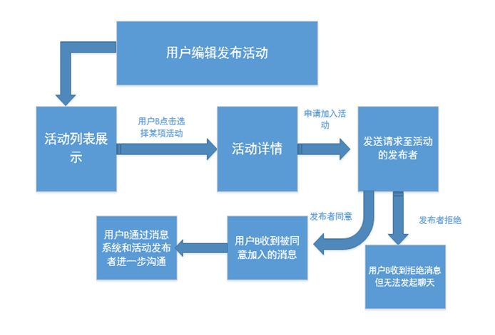

### 项目介绍
基于微信小程序的校园活动广场，是本人本科的毕业设计，目的是想为了丰富大学生的在生活，和提供一个校园活动的消息管理平台。但由于小程序审核限制，个人版暂时无法上线。
### 2.项目组成
wepy小程序 + express服务 + mongodb数据库

### 3.功能

<input type="checkbox" disabled checked="checked" style="line-height:30px;">活动发布

<input type="checkbox" disabled checked="checked" style="line-height:30px;">活动列表

<input type="checkbox" disabled checked="checked" style="line-height:30px;">活动详情

<input type="checkbox" disabled checked="checked" style="line-height:30px;">活动删除

<input type="checkbox" disabled checked="checked" style="line-height:30px;">消息列表

<input type="checkbox" disabled checked="checked" style="line-height:30px;">消息管理

### 4.项目架构
1.整体架构

  

2.小程序前端流程图  

### 5.功能效果图
1.活动列表

2.活动详情

3.消息管理
  

